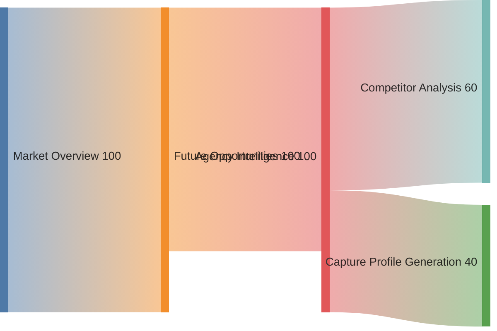

### May 2025 Progress Update

## USAspending ETL Pipeline, Data Model, and Semantic Search/RAG Readiness (May 2025)

### Three-Stage Schema Architecture (Updated May 2025)

- **s1_raw**: Ingests and stores unmodified source data (e.g., from USAspending.gov) for full provenance and reproducibility. No transformations or deduplication are performed at this stage. Table names mirror the source.
- **s2_interim**: Receives cleansed, normalized, and type-corrected data. Deduplication is not performed here; indexes are not created at this stage to maximize write speed. Used as the staging area for further processing.
- **s3_processed**: Contains deduplicated, performance-optimized, and analytics-ready tables. All indexes, vector/embedding columns, materialized views, and all precomputed filter/aggregation tables (filter values, dependencies, quarterly_data, etc.) are created here. This schema is the foundation for high-performance analytics, AI/LLM, and RAG workflows.

#### Key Pipeline Updates (May 2025)

- **Deduplication** is now fully automated and robust for both prime awards and subawards:
  - Prime deduplication uses `contract_transaction_unique_key` as the primary key.
  - Subaward deduplication uses a composite key (`prime_award_unique_key`, `subaward_number`, `subaward_action_date`).
  - Deduplication reads from `s2_interim` and writes to `s3_processed`.
  - All index creation and precomputed table logic is now handled in the transformation stage, and all such tables are created only in `s3_processed`.
- **Transformation** is fully automated and idempotent:
  - Uses only `s3_processed.usaspending_prime_awards` and `s3_processed.usaspending_subawards` as the source for all preprocessing and aggregations.
  - Creates all recommended indexes and precomputes filter/aggregation tables for high-performance analytics and UI filtering, all in `s3_processed`.
  - Computes fiscal year and quarter dynamically from `action_date`.
  - All scripts are modular, schema-aware, and safe for repeated runs.
- **AI/LLM/RAG Readiness**:
  - The pipeline is now future-proofed for semantic search, web/RAG enrichment, and downstream extensibility.
  - All tables and models are designed for easy extension as new AI, MCP, or LLM features are added.

**Rationale:**

- Enables robust data lineage, reproducibility, and rapid reprocessing.
- Supports future extensibility for new data sources and schema evolution.
- Aligns with best practices for high-volume, AI-augmented analytics pipelines.

### Documentation and Cross-References (Updated)

- **ETL Scripts:**
  - Deduplication: [`src/backend/data/data_processing/deduplication.py`](../src/backend/data/data_processing/deduplication.py)
  - Transformation: [`src/backend/data/data_processing/transformation.py`](../src/backend/data/data_processing/transformation.py)
- **Data Models:** [`src/backend/data/models/data_models.py`](../src/backend/data/models/data_models.py)
- **Database Schema:** See [`docs/DATABASE_SCHEMA.md`](DATABASE_SCHEMA.md) for table and field definitions, including vector/embedding columns and document storage.
- **Planning:** This section and related updates document the rationale, implementation, and future-proofing for AI/LLM and RAG readiness.

### Status

- ✅ ETL pipeline refactor, deduplication, and transformation automation complete (May 2025)
- ✅ Pipeline is modular, schema-aware, and ready for AI/LLM/RAG use cases

---

---

- **WSL2 Ubuntu 22.04 LTS with NVIDIA Container Toolkit**: Complete. Confirmed GPU access in Docker containers for RTX 4060.
- **Ollama and FastAPI Chat API Docker Compose Integration**: Complete. Both services run as containers, with Ollama using GPU.
- **Langfuse and Pydantic AI Tracing**: Complete. Centralized tracing module implemented, all config in `.env`/`.env.example`.
- **Prompt Template System**: Complete. Markdown-based prompt templates in place, loaded by chat API.
- **Configuration Refactor**: Complete. All config now accessed via function-based accessors in `config.py`.
- **Documentation and Planning**: In Progress. Modularization and AI integration plans updated, but ongoing as features are added.
- **AI Chat Endpoint**: In Progress. FastAPI endpoint scaffolded, ready for further development in a new branch.

---

| Task/Phase                                | Status      |
| ----------------------------------------- | ----------- |
| WSL2 Ubuntu 22.04 LTS + NVIDIA Toolkit    | Complete    |
| Docker Compose: Ollama + FastAPI Chat API | Complete    |
| GPU Access in Containers                  | Complete    |
| Langfuse + Pydantic AI Tracing            | Complete    |
| Centralized Config via config.py          | Complete    |
| Prompt Template System (Markdown)         | Complete    |
| FastAPI Chat Endpoint (scaffold)          | In Progress |
| Modularization/AI Planning Docs           | In Progress |
| AI Chat Feature (full)                    | Not Started |

# PLANNING.md

## Table of Contents

1. [Purpose](#purpose)
2. [High-Level Vision](#high-level-vision)
3. [Architecture](#architecture)
4. [Tech Stack & Tools](#tech-stack--tools)
5. [Database Optimization](#database-optimization)
6. [User Interface & UX Enhancements](#user-interface--ux-enhancements)
7. [AI/ML & Agent Integration](#aiml--agent-integration)
8. [Opportunity Research & Capture Workflow](#opportunity-research--capture-workflow)
9. [Company & Competitor Capabilities Modeling](#company--competitor-capabilities-modeling)
10. [Planned Features & Improvements](#planned-features--improvements)
11. [Implementation Status & Roadmap](#implementation-status--roadmap)

---

## Purpose

The **USAspending.gov Data Explorer** is a Streamlit-based web application designed to help users explore, filter, and visualize government spending data from the USAspending.gov dataset. The app aims to provide actionable insights for business development, competitive analysis, and opportunity identification by allowing users to query contract data, view spending trends, and identify expiring contracts.

## High-Level Vision

- **Data Exploration**: Enable users to filter contract data by dimensions such as date range, agency, contractor, NAICS/PSC codes, contract type, extent competed, and set-aside type.
- **Visual Insights**: Provide visualizations to understand spending trends, identify top recipients/NAICS codes/agencies, and highlight expiring contracts.
- **Capture Profile Generation**: Allow users to select a contract and generate a capture profile (Word document) with details, analysis, visuals, and AI-generated narratives for proposal support.
- **Performance and Usability**: Ensure fast query performance and a clean, intuitive UI with proper formatting and interactivity.
- **No cost and open source**: Ensure we are keeping this effort to a no cost framework.
- **Integrated Data Sources**: Combine historical data (USAspending.gov) with future opportunity data (SAM.gov) and additional sources to support enhanced capture management, providing a comprehensive view of past performance and upcoming opportunities.
- **Comprehensive Capture Management**: Utilize outputs from all AI tools and data sources to create complete, polished Capture Profiles representing the true end state of the system, enabling strategic decision-making and proposal development.

## Architecture

### Updated Modular Architecture

The codebase has been restructured to follow a clean, modular approach with improved organization:

```
Data_Insights/
├── config.py                     # Configuration settings (root level)
├── app.py                        # Main Streamlit application entry point
├── requirements.txt              # Dependencies
├── .env                          # Environment variables (not in git)
├── .env.example                  # Example environment variables
├── data/                         # Data files
├── docs/                         # Documentation
├── logs/                         # Log files
├── tests/                        # Unit tests
└── src/                          # Source code
    ├── backend/                  # Backend functionality
    │   ├── core/                 # Core backend functionality
    │   │   ├── database.py       # Database connection and utilities
    │   │   ├── maintenance.py    # Database maintenance utilities
    │   │   └── utils.py          # Common utilities
    │   ├── data_processing/      # Data processing modules
    │   │   ├── cleansing.py      # Data cleaning functions
    │   │   ├── transformation.py # Data transformation
    │   │   ├── import.py         # Data import utilities
    │   │   └── migration.py      # Database migration utilities
    │   ├── data_acquisition/     # Data acquisition modules
    │   │   ├── sam_gov.py        # SAM.gov API integration
    │   │   ├── nato_nspa.py      # NATO NSPA data acquisition
    │   │   ├── usaspending.py    # USAspending.gov current data
    │   │   └── usaspending_historical.py # USAspending.gov historical data
    │   └── ai/                   # AI integration
    │       └── mcp/              # Model Context Protocol integration
    └── frontend/                 # Frontend UI functionality
        ├── pages/                # Streamlit multipage components
        ├── components/           # Reusable UI components
        ├── visualizations/       # Visualization components
        └── capture/              # Capture management features
```

### Component Architecture

- **Frontend**: Streamlit for the web interface, providing a sidebar for filters, DataFrame displays, and Plotly visualizations. However, open to other suggestions for better performance and user experience.
- **Backend**:
  - PostgreSQL database migrated from the original SQLite (`usaspending_historical.db`) for enhanced performance with large datasets
  - Precomputed tables (`filter_values_*`, `filter_dependencies`) for filter values and dependencies.
  - Pre-aggregated `quarterly_data` table for visualizations.
- **Data Processing**: Pandas for data manipulation, SQLAlchemy for database queries.
- **Visualizations**: Plotly for interactive charts (e.g., line charts, bar charts).
- **AI Integration**: Ollama for local LLM inference to generate capture profile narratives, leveraging the user's GTX 4060 with CUDA.
- **External Data Sources**: API integrations with SAM.gov, SBA's SubNet, GovWin IQ, Bloomberg Government, and potential Salesforce REST API for CRM integration.
- **AI Agent Platform**: Microsoft VSCode Toolkit for Model Context Protocol (MCP) integration to build and deploy local AI tools.

## Tech Stack & Tools

### Tech Stack

- **Python Libraries** (as per `requirements.txt`):
  - `streamlit`: For the web interface.
  - `pandas`: For data manipulation.
  - `sqlalchemy`: For database queries.
  - `plotly`: For visualizations.
  - `ollama`: For local LLM inference.
  - `psycopg2-binary`: For PostgreSQL database connectivity.
  - Additional dependencies: `numpy`, `pyarrow`, `python-dateutil`, etc.
- **Database**: PostgreSQL (migrated from SQLite) for improved performance with large datasets.
- **Hardware**: GTX 4060 with CUDA for GPU-accelerated LLM inference.

### Tools

- **Development**: Python 3.x, Visual Studio Code (or similar IDE).
- **Version Control**: Git (repository at `C:\GitHub\Opp_Sem_Search`).
- **AI**: Ollama for local LLM inference, with models like `llama2` or `mistral` for narrative generation.
- **Claude Desktop**: Claude Desktop can be used to assist with natural language processing tasks, such as summarizing large datasets, generating insights, or drafting narratives for the capture profile generation. It complements the local LLM inference by providing an additional layer of AI-driven analysis and content creation.
- **Model Context Protocol**: Plan to incorporate Model Context Protocol (MCP) into the project to enhance advanced data analysis and predictive insights using the Microsoft VSCode Toolkit for local deployment.
- **PydanticAI**: Agent framework for building production-grade AI applications with structured outputs, type safety, and a dependency injection system. Will provide the foundation for all LLM interactions across MCP tools, ensuring consistent, reliable agent behavior.
- **Langfuse**: Open-source LLM engineering platform for observability, prompt management, evals, and analytics for all AI components in the application. Will track performance of all LLM interactions, store version history of prompts, and provide evaluation frameworks.
- **Crawl4AI**: Open-source LLM-friendly web crawler and scraper for the Web Intelligence Scraper tool. Will provide clean markdown generation for RAG pipelines, structured data extraction, and advanced browser control for navigating complex government websites.
- **AI Agent Suite**: Custom-built local AI tools using MCP integration:
  - Web Scraping/Intelligence Gatherer: AI-powered scraping tool to collect relevant contract and agency information
  - Document Creation Agent: AI assistant to create and update multiple document types (Word, Excel, CSV, PowerPoint) based on analyzed data
  - Visualization Tool: AI-enhanced tool for generating insightful visualizations of contract data
  - Analysis and Reasoning Tool: AI agent to perform complex analysis on multi-source government contract data

## Database Optimization

- **Database Migration**:
  - Migrated from SQLite to PostgreSQL for improved performance with large datasets
  - Optimized PostgreSQL configuration for high-performance queries
- **Data Cleansing Optimizations**:
  - Dramatically improved data cleansing performance using direct SQL transformations
  - Reduced processing time from 3.5+ hours to under 12 minutes for 22 million records
  - Achieved processing speeds of ~29,000 rows per second
  - Eliminated Python overhead by performing transformations directly in PostgreSQL
  - Removed 3.6 million duplicate records (16.58% of the original data)
  - Implemented proper type handling and data normalization in a single SQL operation
- **SAM.gov Integration Improvements**:
  - Implemented robust rate limiting with exponential backoff for API requests
  - Added automatic retry mechanism with configurable maximum retries
  - Enhanced error handling for rate limit, connection, and general errors
  - Created detailed logging system with timestamps for troubleshooting
  - Implemented daily request quota tracking to manage API usage limits
  - Added cache invalidation and session refresh mechanisms
  - Successfully enabled fetching of future opportunity data from SAM.gov, a critical step toward our vision of combining historical contract data with upcoming opportunities
  - Established a foundation for the integrated data environment that will power capture management workflows
  - Resolved HTTP 429 "Too Many Requests" errors with intelligent backoff strategy
- **External Data Source Schema Handling Improvements**:
  - Implemented automated schema migration system for external data sources
  - Created dynamic schema detection that identifies new fields in data sources
  - Added ability to automatically evolve database tables when source data formats change
  - Preserved exact field names and formats from original data sources (XML, CSV, JSON)
  - Implemented case-insensitive column matching to prevent field duplication
  - Eliminated need for manual table deletion when data formats change
  - Added automated logging of schema changes for tracking source data evolution
  - Applied to NATO NSPA data source with immediate reliability improvements
  - Prepared foundation for seamless integration of future data sources
- **PostgreSQL Tables**:
  - `usaprime_cleaned`: Main table with contract data
  - `filter_values_*`: Precomputed filter values for each column
  - `filter_dependencies`: Precomputed dependencies between filters (e.g., agency to sub-agency)
  - `quarterly_data`: Pre-aggregated data for visualizations
- **Indexes**:
  - Columns: `action_date`, `period_of_performance_current_end_date`, `modification_number`, `parent_award_agency_name`, `funding_sub_agency_name`, `funding_office_name`, `recipient_name`, `naics_code`, `product_or_service_code`, `type_of_contract_pricing`, `extent_competed`, `type_of_set_aside`
  - Composite index: `idx_filter_composite` on frequently filtered columns
  - PostgreSQL-specific index optimizations (B-tree, GIN) for improved query performance

## User Interface & UX Enhancements

### Multipage Application Structure

- **Implement Streamlit Multipage Framework**:

  - Leverage Streamlit's built-in multipage functionality by organizing content into distinct pages
  - Create a dedicated `pages/` directory to house separate Python scripts for each section
  - Support automatic sidebar navigation between application sections
  - Ensure consistent styling and navigation experience across pages

- **Logical Page Organization**:
  - **Home/Dashboard**: Strategic overview dashboard with key metrics and insights
  - **Data Explorer**: Advanced filtering and detailed contract data exploration
  - **Visualizations**: Comprehensive visualization library with interactive elements
  - **Capture Profiles**: Interface for generating and customizing capture profiles
  - **AI Tools**: Access to AI-powered features via Model Context Protocol integration
  - **Admin**: Administrative tools for data refresh and system maintenance (restricted access)

### Tabbed Interface Components

- **Implement Tabbed Content Organization**:

  - Use `st.tabs` to organize related content within each page
  - Apply consistent tab naming and organization patterns across the application
  - Maintain optimal number of tabs per page (3-5) to prevent overwhelming users

- **Strategic Tab Implementation**:
  - **Visualization Tabs**: Separate different visualization types (timelines, charts, maps)
  - **Analysis Tabs**: Group different analytical perspectives (financial, competitive, historical)
  - **Configuration Tabs**: Organize advanced settings and customization options
  - **Results Tabs**: Present query results in different formats (table, summary, dashboard)

### Advanced Streamlit Features

- **Session State Management**:

  - Implement `st.session_state` to persist user selections between interactions
  - Create memory-efficient caching for expensive data operations
  - Enable cross-page data sharing while maintaining clean code separation

- **Interactive Elements**:

  - Add interactive callbacks for dynamic content updates without full page refreshes
  - Implement progressive disclosure patterns for complex functionality
  - Use tooltips and contextual help elements to improve usability

- **Performance Optimizations**:

  - Apply `@st.cache_data` and `@st.cache_resource` decorators for efficient data loading
  - Implement lazy loading patterns for computationally expensive visualizations
  - Optimize layout to minimize recomputation during user interaction

- **Visual Enhancements**:
  - Create custom header and footer components for consistent branding
  - Implement animations for state changes and transitions
  - Use consistent color schemes and visual hierarchy to improve information processing

## AI/ML & Agent Integration

#### MCP Chat Agent Integration (May 2025)

- ollama-mcp-server will be integrated as the first general-purpose LLM/chat MCP tool, enabling local, privacy-preserving AI chat features.
- All chat and agent interactions will be traced and observable via Langfuse and Logfire.
- This lays the foundation for a prime agent structure, where a coordinating agent manages all tool and LLM calls with full observability.
- See MODULARIZATION_AND_AI_PLAN.md for detailed roadmap and architecture.

### AI Integration Strategies

#### MCP Tool Integration: GitHub MCP Server (May 2025)

**Status:**

- The GitHub MCP server is now fully integrated as the first Model Context Protocol (MCP) tool in the Data_Insights project.
- The integration is managed via Docker, with configuration in `.vscode/mcp.json` and a dedicated `github-mcp-server/Dockerfile` for reproducible builds.
- The MCP server is launched as a local containerized service, with secure environment variable injection for the GitHub token.
- This enables local, privacy-preserving AI agent workflows for GitHub data and sets the foundation for further MCP tool integrations (web intelligence, document creation, visualization, and analysis agents).

**Key Implementation Details:**

- See `github-mcp-server/Dockerfile` for build and deployment details.
- See `.vscode/mcp.json` for VS Code MCP tool configuration and environment variable handling.
- All MCP tool processing is local, with no external API calls for AI/LLM inference, in line with project privacy requirements.
- Documentation and usage instructions are being updated in `README.md` and `MODULARIZATION_AND_AI_PLAN.md`.

**Next Steps:**

- Expand MCP tool suite with additional agents (web intelligence, document creation, visualization, analysis).
- Continue to document and modularize MCP tool integration for maintainability and scalability.

#### Brave Search MCP (websearch) Tool Integration

**Overview:**
Brave Search MCP is a privacy-focused web search tool that integrates with the Model Context Protocol (MCP) suite. It enables secure, real-time web search and retrieval using the Brave Search engine, returning structured results suitable for downstream AI analysis and RAG pipelines.

**Fit and Value:**

- Complements static web scraping (Crawl4AI) and document retrieval (Vectorize) by providing up-to-date, privacy-respecting web search results.
- Ideal for market research, competitor monitoring, news/event tracking, and supplementing intelligence gathering with the latest public information.
- Can be orchestrated with other MCP tools for layered intelligence workflows.
- All queries and results are handled locally, with no persistent logs or external data sharing, aligning with project privacy requirements.

**Planned Integration:**

- Add Brave Search MCP as a core web intelligence tool in the MCP suite.
- Expose its capabilities in the AI Tools tab and web intelligence dashboard.
- Document its role and best practices for combining with other MCP agents (e.g., Crawl4AI, Vectorize).
- Update planning and architecture docs to reflect its fit and expected benefits.

#### PydanticAI Implementation Strategy

PydanticAI provides a type-safe agent framework for building production-grade AI applications. The following implementation strategy will ensure successful integration with our Data_Insights project:

##### Phase 1: Core Foundation

1. **Core Domain Models**:

   - Define Pydantic models for key federal contract entities
   - Implement models for awards, agencies, opportunities, and contracts
   - Create validation rules specific to federal contracting data
   - Design specialized validators for monetary values, NAICS codes, and agency identifiers

2. **Simple Analysis Agent**:

   - Build a basic contract analysis agent as proof of concept
   - Connect to Ollama for local LLM inference
   - Implement structured response validation
   - Test with sample contract data queries
   - Measure performance and accuracy metrics

3. **Database Integration**:
   - Implement dependency injection for PostgreSQL database context
   - Create data providers for USAspending database
   - Design caching mechanisms for expensive database operations
   - Build type-safe query result mappers to Pydantic models
   - Implement transaction management for agent operations

##### Phase 2: MCP Tool Integration

4. **Capability Identifier Tool**:

   - Define structured output models for capability identification
   - Implement competitor capability modeling
   - Create gap analysis schema with validated outputs
   - Design structured competitiveness assessment metrics
   - Build win probability estimation models

5. **Document Creator Agent**:

   - Develop document schema models for different output types
   - Implement structured section generators
   - Create validation for narrative sections
   - Design templating system with typed parameters
   - Build export validation for different formats

6. **Web Intelligence Scraper**:

   - Design models for intelligence sources and findings
   - Implement entity detection with validation
   - Create structured intelligence digest schema
   - Build search result validation models
   - Develop models for competitive intelligence analysis

7. **Visualization Tool Enhancement**:
   - Implement chart configuration models
   - Create visualization recommendation schemas
   - Design data validation for visualization inputs
   - Build query-to-visualization converter models
   - Implement annotation and metadata schemas

##### Phase 3: Advanced Features

8. **Agent Composition**:

   - Implement modular agent design with composition patterns
   - Create agent pipelines with validated intermediate outputs
   - Design typed communication protocols between agent components
   - Build testing framework for agent interactions
   - Implement error handling and recovery strategies

9. **Domain-Specific Models**:

   - Create structured models for opportunity qualification
   - Implement capture planning document schemas
   - Design competitive analysis report structures
   - Build price-to-win models with structured components
   - Develop proposal strategy recommendation schemas

10. **Integration with Langfuse**:
    - Implement tracing for structured outputs
    - Create evaluation metrics based on model validation
    - Design test datasets for agent validation
    - Build performance dashboards using structure definitions
    - Implement A/B testing framework for model variants

#### Implementation Guidelines

1. **Start Small**: Begin with core models and a simple agent to test the integration framework
2. **Incremental Adoption**: Gradually incorporate PydanticAI into each MCP tool
3. **Type Safety First**: Leverage Python type hints throughout the implementation
4. **Test-Driven Development**: Create comprehensive tests for all models and agents
5. **Consistent Patterns**: Establish standard patterns for dependency injection and error handling
6. **Documentation**: Document all models and their validation rules for future reference

This implementation strategy aligns with the project's focus on local processing, strong validation, and domain-specific AI capabilities for federal contract analysis.

### AI/ML Training and Integration Plan

#### Training AI on USAspending.gov Data

To maximize the value of the USAspending.gov database, we will train local AI and machine learning models directly on the cleansed and transformed contract data stored in PostgreSQL. This approach ensures all sensitive data remains on-premises, in line with project privacy requirements.

##### Local AI/LLM Fine-Tuning

- Fine-tune local large language models (LLMs) such as Llama2 or Mistral using contract text, award narratives, and historical outcomes.
- Use Ollama to run and fine-tune models on the user's hardware (GTX 4060 with CUDA), enabling:
  - More accurate, context-aware contract analysis and summarization
  - Generation of tailored capture profile narratives and win strategies
  - Improved natural language query support for the dashboard
- All training and inference will be performed locally, with no external API calls.

##### Machine Learning Integration

- Develop classical ML models (e.g., scikit-learn, XGBoost, LightGBM) for:
  - Predicting contract win probability (PWin) based on historical award data
  - Forecasting spending trends and contract expirations
  - Clustering contracts/agencies for market segmentation
  - Anomaly detection to flag unusual contract activity or data quality issues
- Integrate these models into backend processors for real-time analytics and dashboard visualizations.
- Enable users to run ML-powered analyses (e.g., "Show me likely expiring contracts" or "Cluster similar opportunities") via the Streamlit UI.

##### Example Use Cases

- AI-generated executive summaries for selected contracts
- Automated classification of contract types, agencies, or recipients
- Predictive analytics for opportunity qualification and pipeline management
- Outlier detection for compliance and risk analysis
- Interactive, ML-driven visualizations (e.g., clustering, trend forecasting)

##### Implementation Roadmap

- Phase 1: Prepare and document training datasets from the PostgreSQL database
- Phase 2: Fine-tune LLMs and train ML models locally; validate outputs
- Phase 3: Integrate models into backend processors and Streamlit UI
- Phase 4: Expand AI/ML features based on user feedback and new data sources

This plan will be documented and tracked in MODULARIZATION_AND_AI_PLAN.md and referenced in TASKS.md and README.md as features are implemented.

### MCP Tools Integration for Streamlit App

- **GitHub MCP Server is now integrated as the first MCP tool, available for local agent workflows.**
- **Create dedicated "AI Tools" tab with multi-tab interface in Streamlit**
- **Add conversational AI assistant embedded in the Streamlit sidebar**
- **Implement capture profile generation UI with customization options**
- **Create web intelligence dashboard for market intelligence gathering**
- **Add AI-assisted visualization recommendation engine**
- **Implement natural language query-to-visualization converter**

## Opportunity Research & Capture Workflow

### Overview

The user journey is designed to start broad and progressively narrow down to actionable intelligence and capture profile generation:

1. **Market Overview**: Users begin with a high-level dashboard showing overall government spending, top agencies, NAICS/PSC codes, and expiring contracts.
2. **Future Opportunities**: Users identify upcoming opportunities (e.g., from SAM.gov, NATO NSPA) and expiring contracts. The main table allows row selection (using AgGrid) for one or more opportunities.
3. **Drilldown to Agency Intelligence**: Selecting a contract row in "Future Opportunities" triggers downstream tabs (Agency Intelligence, Competitor Analysis, etc.) to focus on the selected opportunity's context (agency, NAICS, etc.), using robust Pydantic models for data flow and validation.
4. **Competitor & Market Analysis**: Users can further explore competitive landscape, teaming, and historical performance for the selected agency or opportunity.
5. **Capture Profile Generation**: For any selected opportunity, users can generate a detailed capture profile (Word document) with AI-generated narrative, visuals, and recommendations.

### Technical/UX Implementation

- **Tab Coordination**: When a user selects a row in "Future Opportunities," the selected contract's details (as a Pydantic model) are passed to downstream tabs (Agency Intelligence, Competitor Analysis, etc.) via session state.
- **Contextual Tabs**: Downstream tabs auto-focus on the selected opportunity/agency, hiding or disabling their own selectors if context is set.
- **Pydantic Models**: All opportunity, agency, and contract data passed between tabs uses strict Pydantic models for type safety and extensibility.
- **Capture Profile Button**: Each opportunity row includes a "Generate Capture Profile" button, which triggers the document creation workflow.

### Visual Workflow (MCP + Mermaid/Sankey)

- **Model Context Protocol (MCP)**: Plan to use MCP for orchestrating AI agents (web scraping, document creation, visualization, analysis) and for diagramming workflows.
- **Mermaid/Sankey Diagrams**: Will use Mermaid (and possibly Sankey diagrams) to visually represent the user workflow and data flow between dashboard components and AI agents. This will help with both documentation and future automation/orchestration.

#### Example Mermaid Sankey Diagram (planned):



### Next Steps

- Implement session state and tab coordination for opportunity selection and downstream context.
- Integrate Pydantic models for all inter-tab data flow.
- Prototype Mermaid/Sankey diagram generation for workflow documentation and orchestration.
- Plan for MCP-based agent orchestration for future automation.

## Company & Competitor Capabilities Modeling

### Capabilities Assessment Tab (Planned)

- **Purpose:** Establish a structured, queryable foundation of your company's (KBR and subsidiaries) capabilities, awards, and business model for use in all downstream research, gap analysis, and AI-driven workflows.
- **Data Sources:**
  - USAspending.gov: All prime awards and subcontracts for KBR (parent and all subsidiary UEIs)
  - Data elements: price/cost, transaction/parent descriptions, NAICS/PSC codes and descriptions
  - Web crawl: Company websites to extract business model, capabilities, and service areas
  - Social media: X.com (Twitter) posts for recent news, positioning, and partnerships
  - BloombergGov API: Additional company intelligence and market positioning
- **AI/Agent Workflow:**
  - All data is processed through the Prime AI Agent, which orchestrates MCP tools and other AI agents for web crawling, semantic search, and summarization.
  - Extracted data is used to generate key words/phrases for semantic search and future competitor research.

### Initial Company Capabilities Pull

- **Purpose:** Establish a structured, queryable foundation of your company's (KBR and subsidiaries) capabilities, awards, and business model for use in all downstream research, gap analysis, and AI-driven workflows.
- **Data Sources:**
  - USAspending.gov: All prime awards and subcontracts for KBR (parent and all subsidiary UEIs)
  - Data elements: price/cost, transaction/parent descriptions, NAICS/PSC codes and descriptions
  - Web crawl: Company websites to extract business model, capabilities, and service areas
  - Social media: X.com (Twitter) posts for recent news, positioning, and partnerships
  - BloombergGov API: Additional company intelligence and market positioning
- **AI/Agent Workflow:**
  - All data is processed through the Prime AI Agent, which orchestrates MCP tools and other AI agents for web crawling, semantic search, and summarization.
  - Extracted data is used to generate key words/phrases for semantic search and future competitor research.

### Storage Format Recommendation

- **JSON is recommended** for storing company capabilities in PostgreSQL:
  - Supports structured, nested data (e.g., capabilities, awards, relationships, news, etc.)
  - Enables efficient querying, filtering, and updating (using PostgreSQL's JSONB features)
  - Easily extensible for new data fields and future AI-driven enrichment
  - Markdown is best for human-readable reports, but not for structured, programmatic access
- **Workflow:**
  - Store the canonical company capabilities profile as a JSONB column in a dedicated table (e.g., `company_capabilities`)
  - Optionally, generate markdown or Word/PDF reports from the JSON for human consumption

### Suggestions & Best Practices

- Use a Pydantic model to define the schema for company capabilities (and competitor profiles) to ensure type safety and extensibility
- Build a pipeline to periodically refresh company capabilities from all sources (scheduled or on-demand)
- Use the same pipeline and schema for competitor research, enabling direct comparison and gap analysis
- Leverage AI agents for entity resolution (matching subsidiaries, UEIs, etc.) and for extracting/normalizing capabilities from unstructured sources
- Store provenance/metadata for each data element (source, date, confidence, etc.)
- Use semantic search embeddings (e.g., via local LLM) to enable fast, relevant retrieval of capabilities and news

### Company & Competitor Capabilities Data Model and Storage Plan (2025)

#### Pydantic Model Scaffold

```python
from pydantic import BaseModel, Field
from typing import List, Optional, Dict
from datetime import date

class SubcontractorRelationship(BaseModel):
    name: str
    uei: Optional[str]
    relationship_type: Optional[str]  # e.g., "JV", "Sub", "Mentor-Protégé"
    start_date: Optional[date]
    end_date: Optional[date]
    description: Optional[str]

class AwardSummary(BaseModel):
    award_id: str
    agency: str
    naics_code: str
    psc_code: Optional[str]
    description: Optional[str]
    value: float
    start_date: Optional[date]
    end_date: Optional[date]
    is_prime: bool

class NewsItem(BaseModel):
    title: str
    url: Optional[str]
    date: Optional[date]
    summary: Optional[str]
    source: Optional[str]

class CapabilityKeyword(BaseModel):
    keyword: str
    weight: Optional[float] = 1.0  # For semantic search

class CompanyCapabilitiesProfile(BaseModel):
    company_name: str
    parent_uei: str
    subsidiary_ueis: List[str] = []
    business_model: Optional[str]
    core_capabilities: List[str]
    naics_codes: List[str]
    psc_codes: List[str]
    awards: List[AwardSummary]
    subcontractors: List[SubcontractorRelationship]
    news: List[NewsItem]
    capability_keywords: List[CapabilityKeyword]
    last_updated: date
    provenance: Optional[Dict[str, str]] = None  # e.g., {"awards": "usaspending.gov", ...}
```

#### Sample JSON Schema

See the previous answer for a full sample. This is the structure that will be stored in the database.

#### PostgreSQL Table Design & Storage Best Practices

- **One company per row**: Each company (KBR, or a competitor) gets one row in the table.
- **JSONB column**: All structured data (capabilities, awards, news, etc.) is stored in a single `profile` column of type `jsonb`.
- **Relational columns**: Add a few regular columns for fast lookup and filtering, e.g.:
  - `company_name` (text)
  - `parent_uei` (text)
  - `last_updated` (date)
- **Table example:**

```sql
CREATE TABLE company_capabilities (
  id SERIAL PRIMARY KEY,
  company_name TEXT,
  parent_uei TEXT,
  profile JSONB,
  last_updated DATE
);
```

- **Indexing**: Use a GIN index on the `profile` column for fast JSONB search:

```sql
CREATE INDEX idx_company_profile ON company_capabilities USING GIN (profile);
```

- **Querying**: You can query inside the JSONB, e.g.:

```sql
SELECT * FROM company_capabilities WHERE profile->'naics_codes' ? '561210';
```

- **Segmentation**: For most use cases, keep all company data in the `profile` JSONB column. If you have very large arrays (e.g., thousands of awards), you can later move those to a separate table, but this is rarely needed at first.

#### Competitor Analysis Schema

- You can use the **same table and schema** for both your company and competitors. Just add a column like `is_competitor BOOLEAN` or a `profile_type` column (e.g., 'company', 'competitor') if you want to distinguish them.
- If you expect to store a very large number of competitors or want to keep them separate, you can create a second table (e.g., `competitor_capabilities`) with the same structure.
- **Recommendation:** Start with a single table for both, and only split if you run into performance or organizational issues.

#### Simple Explanation

- **One row = one company or competitor.**
- **All structured data (capabilities, awards, news, etc.) is stored as a single JSON object in the `profile` column.**
- **You can add regular columns for fast search (e.g., company name, UEI).**
- **PostgreSQL's JSONB type is designed for this use case and is very efficient for both storage and querying.**
- **If you ever need to split out a large sub-object (like awards), you can do so later without changing the rest of your design.**

## Planned Features & Improvements

### Planned Features

- **Strategic Default Dashboard**:

  - Provide automatic strategic-level insights dashboard on app startup
  - Display historical contract data summary and projected spend for next 24-36 months
  - Include interactive visualizations including heatmaps, bar charts, and pie charts for:
    - Top agencies, sub-agencies, and offices by award actions and obligations
    - Top NAICS codes by award actions and obligations
    - Contract vehicles distribution (IDV, single/multiple award) by agency
    - Geographic distribution of contract awards (heatmap)
    - Expiring contracts in the next 6-24 months (timeline view)
    - Projected spend forecast based on historical trends
    - Competitive landscape analysis
    - Small business participation metrics
  - **Projected Awards and Suitability Overlay Chart**: Add a projection chart that takes all active contracts and projects their next award date and obligations. Overlay a second line based on the suitability of our company, showing both total projected spending and the potential amount our company could win.
    - _Reason/Benefit_: This enables users to visually compare the overall market opportunity with the realistic, suitability-filtered opportunity for their company, supporting strategic targeting and resource allocation.
  - **Similar NAICS Table via LLM Semantic Search**: Add a table that identifies NAICS codes similar to the one being filtered, using LLM-based semantic search on NAICS codes and descriptions. This will help users discover adjacent or unexplored market areas.
    - _Reason/Benefit_: By surfacing related NAICS codes, users can expand their market research, identify diversification opportunities, and avoid missing relevant opportunities due to narrow filtering.
  - **Interactive Sankey Diagram (Agency → Office → Contract)**: Add an interactive Sankey diagram as the last visual, tracing the flow from parent agency to office level and further into contract levels.
    - _Reason/Benefit_: This provides a clear, intuitive visualization of how obligations and actions flow through the federal hierarchy, helping users identify bottlenecks, key offices, and contract concentrations for more effective targeting.
  - Implement dynamic filtering with real-time visualization updates
  - Add market share analysis for contractors within selected NAICS codes
  - Include opportunity timeline showing contract expirations and projected solicitations

- **Generate Capture Profile**:

  - Allow users to select a row in the DataFrame and generate a Word document ("Capture Profile") with contract details, analysis, and AI-generated narratives (e.g., win strategies for proposals).
  - Use `python-docx` for document generation.
  - Integrate Ollama for local LLM inference, leveraging the user's GTX 4060 with CUDA for performance.
  - Ensure all processing remains local to protect private information.

- **Incorporate Model Context Protocol (MCP)**:

  - Integrate MCP with Microsoft VSCode Toolkit to create and deploy local AI agents
  - Develop intelligence gathering tool for web scraping and data collection
  - Build document creation and updating agent for multiple formats (Word, Excel, CSV, PowerPoint)
  - Create visualization and analytics tools for data-driven insights
  - Implement reasoning tool for strategic analysis of government contract data

- **MCP Tools Integration for Streamlit App**:

  - Create dedicated "AI Tools" tab with multi-tab interface in Streamlit
  - Add conversational AI assistant embedded in the Streamlit sidebar
  - Implement capture profile generation UI with customization options
  - Create web intelligence dashboard for market intelligence gathering
  - Add AI-assisted visualization recommendation engine
  - Implement natural language query-to-visualization converter

- **Implement Shipley Capture Milestone Mapping**:

  - Create data model for Shipley milestone framework (0-3) in the database
  - Develop milestone tracking dashboard with milestone-specific KPIs
  - Implement automated data collection for milestone decision requirements
  - Integrate advanced pricing analysis components:
    - Historical price range analysis
    - Pricing strategy percentile analysis
    - Agency-specific pricing patterns analysis
    - Competitor pricing analysis
    - Price-to-win predictive modeling
  - Design comparison views for competitive assessment at each milestone

- **Create Robust Data Dictionary**:

  - Document all database tables, views, and their relationships
  - Define each data field with descriptions, data types, and business context
  - Map data fields to their source systems and transformation logic
  - Build searchable data dictionary interface within the application
  - Implement data lineage tracking for complex derived fields

- **External Data Source Integration**:

  - **USAspending.gov**: Primary source for historical contract data
  - **SAM.gov API**: Integration for future opportunity data
  - **SBA Mentor-Protégé Agreements**: Partnership data from SBA.gov providing insights on mentor-protégé relationships (https://www.sba.gov/document/support-active-mentor-protege-agreements)
  - **SBA's SubNet**: Integration for subcontracting opportunities
  - **Bureau of Labor Statistics (BLS) API**: Economic data including employment, wages, and price indices to provide market context and economic trends
  - **GovWin IQ API**: Pre-RFP intelligence and teaming partners (requires API key)
  - **Bloomberg Government API**: Financial insights and subcontractor data (requires API key)
  - **Salesforce REST API**: Capture management and CRM functionality integration

- **Admin-Only Data Fetch Interface**:

  - Create admin authentication system using environment variables
  - Build data fetch interface with source selection options
  - Implement progress indicators and status monitoring
  - Add detailed logging and notification system

- **Capture Management Enhancement**:

  - Pipeline building with automatic opportunity feeds into CRM systems
  - Opportunity qualification with scoring models for probability of win
  - Teaming and relationship building through subcontractor identification
  - Competitive analysis with visualization of competitor trends
  - Proposal development with automated extraction of key RFP terms

- **Competition Intensity Analysis**:

  - Create a dedicated "Competition Intensity" dashboard component showing:
    - Average number of bidders by agency, NAICS code, and contract type
    - Visual classification of high, medium, and low competition markets
    - Trend analysis showing changes in competitive density over time
    - "Sweet spot" identification for optimal value-to-competition ratio
    - Correlation between competition levels and contract values
  - Implement competition-based filtering options in the sidebar
  - Develop a mathematical pWin model incorporating number of bidders as a key factor
  - Integrate competition intensity metrics into opportunity qualification scoring
  - Create specialized visualizations showing competitive density across federal market segments

### Potential Improvements

- Add pagination or lazy loading to the DataFrame to handle large datasets more efficiently.
- Enhance visualizations with interactive features (e.g., tooltips, drill-downs).
- Implement additional filters or search capabilities (e.g., keyword search in contract descriptions).
- Optimize database queries further if performance issues arise with larger datasets.

## Implementation Status & Roadmap

### Implementation Status

#### Completed Features

- ✅ **Application Architecture**: Modular structure with clear separation of concerns
- ✅ **PostgreSQL Integration**: Connection, queries, and data management
- ✅ **Basic UI**: Streamlit interface with filtering and visualization
- ✅ **Dashboard**: Strategic overview with metrics and charts
- ✅ **Tabbed Interface**: Content organization with tabs for different views
- ✅ **Multipage Structure**: Navigation between dedicated application pages
- ✅ **Centralized Theme and CSS**: All theme colors and CSS are now centralized in `src/frontend/styles/theme.py` and `custom_css.py`.
- ✅ **Reusable Visualization Components**: All chart and metric logic is modularized under `src/frontend/visualizations/charts/` and `components/`.
- ✅ **Centralized Filter Logic**: All filter UI and logic are now in `src/frontend/components/filters.py`, supporting robust filter state management and a reliable Clear Filters button.
- ✅ **Layout Component Library**: Standardized grid, card, and sidebar layouts are now implemented in `src/frontend/components/layouts/grid.py` and used throughout the dashboard for consistent UI structure.
- ✅ **Pydantic Model Integration**: All backend processor functions now return lists of Pydantic models for major data flows, and the frontend/tab code has been refactored to consume these models.
- ✅ **Logging and Diagnostics**: File-based logging and robust sidebar diagnostics are implemented for traceability and debugging.
- ✅ **First MCP Tool Integrated**: GitHub MCP server is now running as a local MCP tool, with Docker-based deployment and VS Code integration for secure, local agent workflows.

#### In Progress

- 🔄 **Advanced Filtering**: Enhanced data filtering capabilities (multi-select, keyword search, competition intensity)
- 🔄 **Export Functionality**: CSV and Excel export for data tables
- 🔄 **AI Integration**: Local LLM inference with Ollama, MCP agent scaffolding, and capture profile generator UI

#### Pending

- ⏱️ **Capture Profile Generation**: AI-assisted document creation
- ⏱️ **External Data Integration**: SAM.gov and other data sources
- ⏱️ **Full MCP/AI Agent Integration**: Web intelligence, document creation, visualization, and analysis tools

### Next Steps

#### Short Term

1. Complete the filter implementation in the sidebar
2. Implement the Data Explorer page with advanced filtering
3. Create the Visualizations page with interactive charts

#### Medium Term

1. Implement state persistence between pages
2. Add export functionality for all data views
3. Enhance visualizations with interactive features

#### Long Term

1. Integrate local LLM inference with Ollama
2. Implement capture profile generation
3. Add external data integration (SAM.gov, etc.)
4. Create AI agents using Model Context Protocol

## Recent Implementation Updates (May 2025)

### Contract Vehicle Analysis Tab

- Fixed KeyError by aggregating vehicle preference by agency directly from the original DataFrame using the correct columns: 'parent_award_agency_name', 'award_type', and 'federal_action_obligation'.
- Fixed KeyError for 'vehicle_type' and 'obligation' by using 'contract_vehicle' and aggregating from the original DataFrame as needed.
- Replaced all references to THEME['category_colors'] with a local CATEGORY_COLORS list for Plotly charts.
- All planned visualizations (pie, stacked bar, line, bar) and export features are implemented and error-free.

### Geographic Analysis Tab

- Implemented all planned visualizations:
  - Choropleth map of obligations by state (using 'recipient_state_code')
  - Bar chart of top states by obligation
  - Geographic concentration of awards (scatter geo map using recipient latitude/longitude and obligation)
- Added export functionality for each visualization.
- Added CATEGORY_COLORS for future categorical charts.
- All error handling and missing data cases are covered.

## Market Overview - Capture Intensity Agency Table (Planned Feature)

### Description

- Add a table to the Market Overview tab showing all agencies that are above the dotted line on the Capture Intensity Chart (i.e., agencies with high capture intensity).
- On each dashboard run, an LLM will analyze the data to:
  - Identify each Agency
  - List its sub-agencies (both awarding and funding)
  - List its offices (both awarding and funding)
  - Calculate and sort by the most compelling Action to Obligation ratio
- **Action to Obligation Ratio (AOR):**
  - Defined as: `AOR = Number of Award Actions / Total Federal Action Obligations`
  - This ratio highlights agencies with a high number of actions relative to dollars obligated, which may indicate more fragmented or competitive markets.
- The table will be selectable (e.g., via AgGrid), and the selected agency/sub-agency/office will feed downstream tabs (Agency Intelligence, Capabilities Assessment, etc.) via session state.
- The LLM-driven analysis will run at each Market Overview render, ensuring up-to-date, context-aware recommendations.

### Implementation Notes

- Table should be interactive and support selection of one or more agencies.
- Downstream tabs should auto-focus on the selected agency context if set.
- The Action to Obligation ratio can be refined over time based on user feedback and observed market patterns.
- LLM analysis can be extended to provide narrative insights or recommendations for each agency.

---

# Cross-References

- See `CAPTUREINTEL.md` for detailed capture intelligence workflows and models.
- See `MODULARIZATION_AND_AI_PLAN.md` for AI/ML modularization and agent orchestration.
- See `DATABASE_SCHEMA.md` for full database schema and data dictionary.
- See `strategic_dashboard_implementation.md` for dashboard-specific implementation details.

---

# Revision Notes

- This document has been reorganized for logical grouping and efficient reference. All original content is preserved and supplemented as needed. Table of contents and cross-references added for clarity.

### USAspending Slim Table Architecture (May 2025)

#### Subawards Table Update (May 2025)

Due to data quality issues with the `usaspending_subawards_slim` table (all `prime_award_unique_key` values are null), the project will use the main `usaspending_subawards` table for subaward analytics and AI workflows.

**Columns to Use:**

The following columns are required for analytics, reporting, and AI/LLM agent workflows:

- `prime_award_unique_key`
- `subaward_type`
- `subaward_number`
- `subaward_amount`
- `subaward_action_date`
- `subaward_action_date_fiscal_year`
- `subawardee_uei`
- `subawardee_name`
- `subawardee_dba_name`
- `subawardee_parent_uei`
- `subawardee_parent_name`
- `subawardee_country_code`
- `subawardee_country_name`
- `subawardee_city_name`
- `subawardee_state_code`
- `subawardee_business_types`
- `subaward_primary_place_of_performance_city_name`
- `subaward_primary_place_of_performance_state_code`
- `subaward_description`

**Key Points:**

- The `usaspending_subawards` table will be queried for these specific columns.
- The join to prime awards will use `prime_award_unique_key` (when available).
- If additional columns are needed for future analytics or AI/LLM workflows, they can be added to this list.
- Materialized views or denormalized tables may be created for specific reporting needs if required.

See `DATABASE_SCHEMA.md` for schema details and join guidance.

### SAM.gov Solicitation Ingestion & Enrichment Pipeline (Foundation)

#### Overview

This pipeline ingests current and historical SAM.gov solicitations, enriches them as `Document` objects, and stores them for semantic search, RAG, and advanced capability/gap analysis. It enables:

- Full-text storage of solicitations (active/inactive)
- Embedding generation for semantic search (via local LLM)
- Metadata and provenance tracking
- Linking to contracts/opportunities for downstream analysis

#### Pipeline Steps

1. **Ingest Data from SAM.gov**: Use `src/backend/data_acquisition/sam_gov.py` to fetch opportunities (API, robust rate limiting, deduplication).
2. **Transform to Document Model**: For each opportunity, create a `Document` instance (see code sample in `/src/backend/data_acquisition/sam_gov_enrichment_example.py`).
3. **Generate Embeddings**: Use local LLM (Ollama) to generate embeddings for the `text` field.
4. **Store in Database**: Store as JSONB + vector (pgvector) for semantic search and RAG.
5. **Enable Semantic Search & RAG**: Use embeddings for fast retrieval and AI-augmented workflows.
6. **Link to Capability/Gap Analysis**: Use full solicitation text for richer requirement extraction and gap analysis.

#### Sample Enrichment Code

See `/src/backend/data_acquisition/sam_gov_enrichment_example.py` for a reference implementation.

#### Documentation

- This pipeline is referenced in `/docs/CAPTUREINTEL.md` (see "Opportunity Insights" and "Data Elements for Business Intelligence").
- Update `.copilot-codeGeneration-instructions.md` to require referencing this plan for all data/AI pipeline code.

---

### SAM.gov Solicitation Ingestion & Enrichment Pipeline (Foundation)

#### Overview

This pipeline ingests current and historical SAM.gov solicitations, enriches them as `Document` objects, and stores them for semantic search, RAG, and advanced capability/gap analysis. It enables:

- Full-text storage of solicitations (active/inactive)
- Embedding generation for semantic search (via local LLM)
- Metadata and provenance tracking
- Linking to contracts/opportunities for downstream analysis

#### Pipeline Steps

1. **Ingest Data from SAM.gov**: Use `src/backend/data_acquisition/sam_gov.py` to fetch opportunities (API, robust rate limiting, deduplication).
2. **Transform to Document Model**: For each opportunity, create a `Document` instance (see code sample in `/src/backend/data_acquisition/sam_gov_enrichment_example.py`).
3. **Generate Embeddings**: Use local LLM (Ollama) to generate embeddings for the `text` field.
4. **Store in Database**: Store as JSONB + vector (pgvector) for semantic search and RAG.
5. **Enable Semantic Search & RAG**: Use embeddings for fast retrieval and AI-augmented workflows.
6. **Link to Capability/Gap Analysis**: Use full solicitation text for richer requirement extraction and gap analysis.

#### Sample Enrichment Code

See `/src/backend/data_acquisition/sam_gov_enrichment_example.py` for a reference implementation.

#### Documentation

- This pipeline is referenced in `/docs/CAPTUREINTEL.md` (see "Opportunity Insights" and "Data Elements for Business Intelligence").
- Update `.copilot-codeGeneration-instructions.md` to require referencing this plan for all data/AI pipeline code.

---
